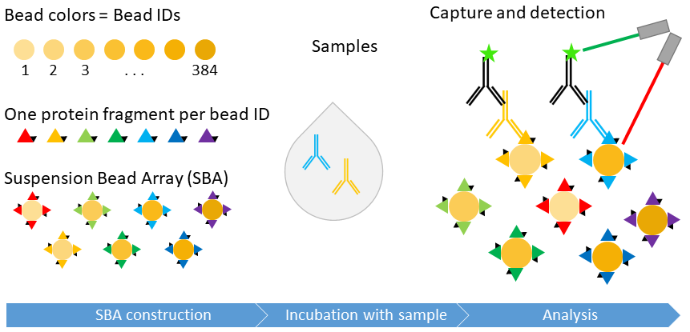

background-image: url(https://ki.se/sites/default/files/migrate/styles/adaptive/public/scilifelab-in-stockholm.jpg)
background-position: right
background-size: contain
???
# Introduction
???
# Introduction

We are from SciLifeLab
blah blah
loggor


knitr::include_graphics("../rappp_pictures/scilifelab.jpg")


background-image: url(https://www.google.com/url?sa=i&source=images&cd=&ved=2ahUKEwiLgISspfbiAhVYwcQBHYArBD4QjRx6BAgBEAU&url=https%3A%2F%2Fki.se%2Fen%2Fresearch%2Fmolecular-biosciences-scilifelab&psig=AOvVaw0gD29mG-DViOdCo8-lWXcA&ust=1561059260613190)


background-image: url(https://upload.wikimedia.org/wikipedia/commons/b/be/Sharingan_triple.svg)

background-image: url(https://thumb.mp-farm.com/90584852/preview.jpg)
https://thumb.mp-farm.com/90584852/preview.jpg
We are from SciLifeLab
blah blah
loggor
 
---

# Method introduction & reason for package
.center[]

---

# Project workflow
GitHub, collaborators
blah blah

---

# Bead count plot

```{r}
median(c(3,5,7,9,26,27))
```


bead_count_ggplot(df_bead_count)


Hej syns detta?
incl benchmark?

---

# Data transformation

---

# Result plots

---

# Conclusions

A new package for our regular data analyis workflow is established

More standardized workflow within group

Knowledge to continue builiding!
