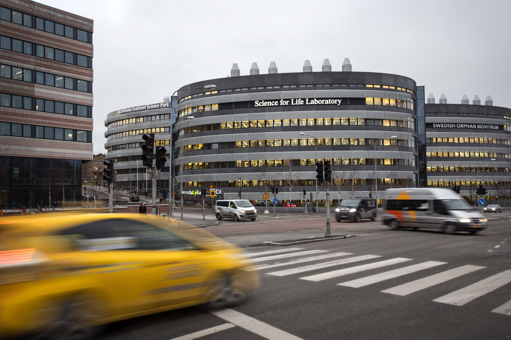
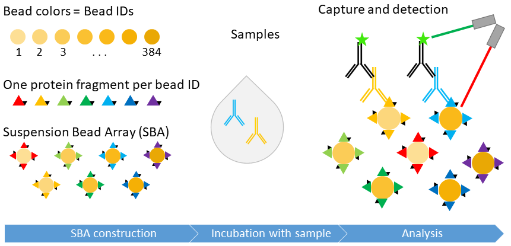
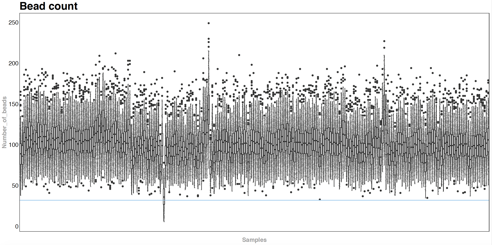
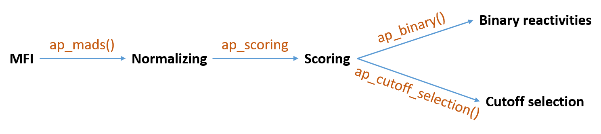
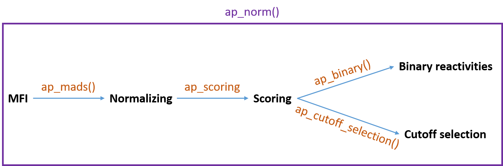
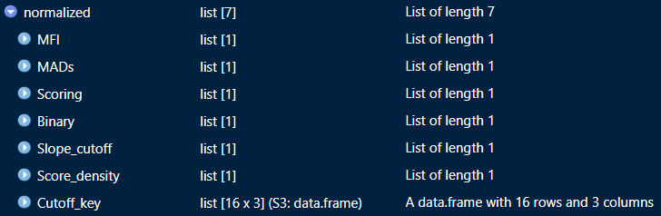
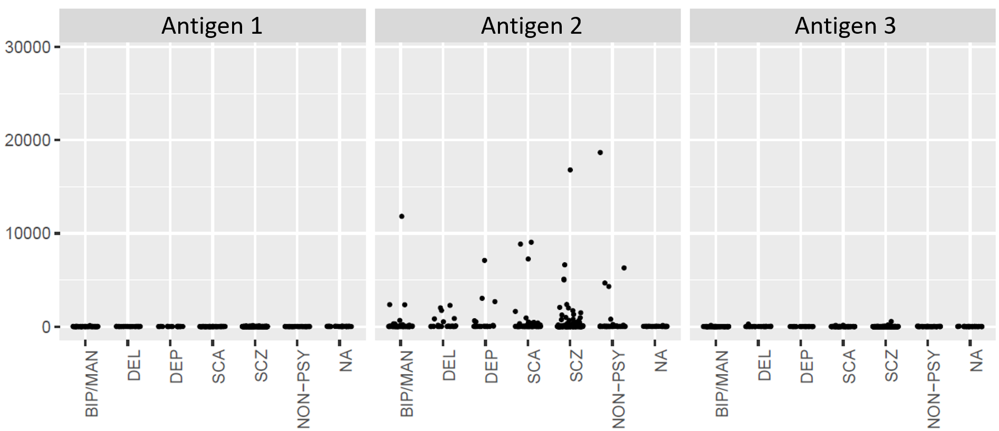

class: inverse, center, middle

```{r, eval = F}
library(rappp)

```

---
# Affinity proteomics
## Protein profiling and Autoimmunity profiling
.center[]


???
background-image: url(https://ki.se/sites/default/files/migrate/styles/adaptive/public/scilifelab-in-stockholm.jpg)
background-position: right
background-size: contain

# Affinity proteomics
## Protein profiling and Autoimmunity profiling
???
We are from SciLifeLab
blah blah
loggor
 
---

# Method introduction & reason for package
.center[]

---

# Project workflow

- New Package template was created locally on Cecilia's computer.
- New repo was created on Cecilia's GitHub.
- The local and GitHub repos were connected.
--

- Forking and cloning by August and Sofia.
- August and Sofia made collaborators, to allow them to accept pull requests themselves.
--

- Incorprate separate funcitons for different parts of our data analysis workflow.
  - Sofia: Bead count visualization
  - Cecilia: Data transformation
  - August: Data visualization

---

# Bead count plot

```{r, eval = F}

bead_count_base(df_bead_count)


```

--
```{r, eval = F}
bead_count_ggplot(df_bead_count)

```
--
```{r, eval = F}
#> system.time(bead_count_base(df_bead_count))
#   user  system elapsed 
# 16.030   0.140  16.255 
#
#
#> system.time(bead_count_ggplot(df_bead_count))
#   user  system elapsed 
#  7.012   0.171   7.233
```


???
---
# Bead count plot with ggplot
.center[]


---

# Data transformation

Basic data transformation workflow:


--


Currently done differently by different people and often with copy-paste.


---
# Data transformation



---
# Data transformation


--

```{r, eval=FALSE}
normalized <- ap_norm(MFI_data)
```
--


```{r, eval=F, size=}
# > system.time(ap_norm(MFI_data))
#   user  system elapsed 
#   0.11    0.00    0.11 
```
   
---

# Data visualization

```{r, eval = F}
beeswarm_ggplot(
  data = SBA_data,
  filename = "filename",
  sample_info = sampleinfo,
  bead_info = beadinfo,
  grouping_var = "diagnosis",
  sample_name_var = "sample_name",
  xlab = c("BIP/MAN", "DEL", "DEP", "SCA", "SCZ", "NON-PSY")
)

```
---
# Data visualization

.center[]

---

# Conclusions and future work

- Established our first package!

- Collaborated using github

- Started to use tidyverse functions<br/>

<br/>
<br/>


  

This will enable us to:
- More standardized workflow within group

- Continue building with our new knowledge!

---
```{r}
sessionInfo()

```

